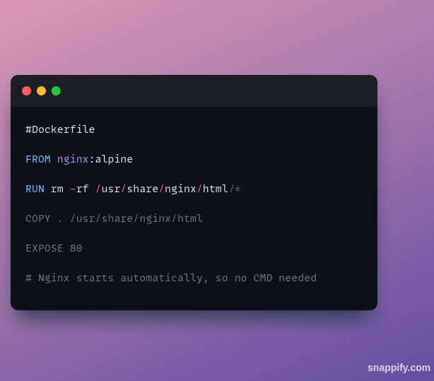

## Title: "SPE Miniproject Report"
### Author: "MT2024039 Deepanshu Saini"
---


### Quick links
- [Github Repo](https://github.com/Deepanshu09-max/SPE_MINI_PROJECT)
- [Calculator Frontend Image on Docker Hub](https://hub.docker.com/repository/docker/deepanshu0903/calc-frontend/general)
- [Calculator Backend Image on Docker Hub](https://hub.docker.com/repository/docker/deepanshu0903/calc-backend/general)

---

### Problem Statement


More details about the problem statement can be found in [this](./Mini%20Project_Scientific%20Calculator.pdf) document.

---

### DevOps

**What is DevOps**  
[DevOps](https://www.atlassian.com/devops) is a set of practices, tools, and cultural philosophies that automate and integrate processes between software development and IT operations teams. Its primary goal is to deliver high-quality software faster and more reliably through collaboration, automation, and continuous improvement.

**Main Aspects of DevOps**  
- **Collaboration and Communication**: DevOps fosters a culture where development, operations, and other stakeholders (like QA and security teams) work together from the start of a project.  
- **Shared Responsibility**: Everyone involved takes collective responsibility for the entire lifecycle of the application, from development to deployment and maintenance.  
- **Continuous Integration (CI)**: Automating the process of integrating code changes into a shared repository, ensuring that new code is automatically built and tested.  
- **Continuous Delivery/Deployment (CD)**: Automating the release process to deploy code changes quickly and safely to production or staging environments.  
- **Version Control Systems**: Systems like Git are the backbone of modern DevOps, providing a way to track changes, collaborate on code, and manage releases.

This approach bridges the gap between Development and Operations, leveraging each team’s strengths. The entire team works across the application lifecycle, illustrated by the loop diagram below:


**Why DevOps?**  
Some key benefits of DevOps relevant to our project:
- **Faster and Better Product Delivery**: Enables safe agility and rapid iteration.  
- **Faster Issue Resolution**: Automated CI pipelines and user-friendly tooling reduce the manual overhead of debugging.  
- **Greater Automation**: Minimizes repetitive tasks, like manual pushing to package managers or running tests locally.

---

### Tools Used

- **Git**  
  A distributed version control system. We used GitHub for commits and issue tracking.
- **Python**  
  The primary language for our scientific calculator application.
- **Pytest**  
  A Python testing tool for unit tests in the calculator functions.
- **Docker**  
  A containerization platform for packaging our project into lightweight containers.
- **Jenkins**  
  An open-source automation server that helps implement CI/CD workflows.
- **Ansible**  
  A configuration management tool for automating deployments and infrastructure tasks.
- **FastAPI**  
  A high-performance Python web framework for serving the calculator’s functionalities.
- **Shell Scripting**  
  Used to automate routine deployment and system configuration tasks.
- **Docker Compose**  
  Defines and runs multiple Docker containers as a single application.
- **HTML**  
  Structures and displays the calculator’s frontend.

---

### Project Structure


- **`backend/Calculator.py`** contains the Python code for the calculator’s logic.
- **`devops/`** holds essential DevOps artifacts (e.g., `Jenkinsfile`, `calc-playbook.yml`, `docker-compose.yml`, etc.).
- **`Dockerfile`** files define how to containerize the backend and frontend.
- **`calc-playbook.yml`** and **`inventory`** manage local or remote deployment via Ansible.

---

### Code Snippets


Key aspects of the Python backend code:
- Edge-case handling (e.g., negative numbers for square roots).
- Computation of required functionalities (factorial, log, power, etc.).
- Logging of inputs and outputs.

---

### Tests


Key aspects of the test code:
- Unit tests for each calculator function.
- Validation of edge cases and correct results.
- Execution via Pytest for quick feedback.

---

## ⚙️ Local Installation and Setup

1. **Clone the Repository**
    ```bash
    git clone https://github.com/AryanRastogi7767/Scientific_Calculator.git
    ```

2. **Install Required Packages**
    ```bash
    pip install -r requirements.txt
    ```

3. **Launch the FastAPI Server**
    ```bash
    uvicorn calculator:app --host 0.0.0.0 --port 8000
    ```

4. **Execute the Tests**
    ```bash
    pytest test.py --tb=short --disable-warnings
    ```


# DevOps Workflow: Docker, Jenkins, and Ansible Integration

## 1. Docker: Build and Run

### Backend Dockerfile

This Dockerfile creates an image for our Python-based backend application.

- Uses a lightweight Python base image (e.g., `python:3.9-slim`).
- Copies Python code and installs dependencies.
- Exposes port `8000` and runs the FastAPI/Flask server.

**Running the Backend Container:**
```bash
docker run -d --name my-calc-back --network spe-mp -p 8000:8000 calc-backend
```

### Frontend Dockerfile

This Dockerfile creates an image for our HTML-based frontend application.

- Uses an Nginx base image (`nginx:alpine`).
- Copies static `HTML/CSS/JS` into Nginx’s `/usr/share/nginx/html`.
- Exposes port `80` for serving frontend files.

**Running the Frontend Container:**
```bash
docker run -d --name my-calc-front --network spe-mp -p 3000:80 calc-frontend
```

---

## 2. Docker Compose: Managing Multiple Containers


A `docker-compose.yml` file is used to orchestrate the backend and frontend services.

- Defines two services: **backend (Python server)** and **frontend (Nginx)**.
- Specifies **images** (or build contexts) and **port mappings** (`8000:8000` and `3000:80`).
- Creates a **shared network** to allow frontend-backend communication using service names.

**Build and Start Containers:**
```bash
docker compose build
```

---

## 3. Pushing Docker Images to Docker Hub

After building the images, we push them to Docker Hub for easy deployment.

1. **Login to Docker Hub:**
```bash
docker login -u <your-username> -p <your-password>
```

2. **Tag the image for Docker Hub:**
```bash
docker tag my-image <dockerhub-username>/<repo-name>:<tag>
```

3. **Push the image to Docker Hub:**
```bash
docker push <dockerhub-username>/<repo-name>:<tag>
```

---

## 4. Jenkins: CI/CD Setup

### Installing Jenkins

#### Prerequisites:
- **OS:** Ubuntu (or Debian-based distros)
- **Java:** Jenkins requires Java 11 or later.

#### Installation Steps:


### A. Install Java
```bash
sudo apt-get update
sudo apt-get install -y openjdk-11-jdk
```

### B. Install Jenkins
```bash
sudo apt-get update
sudo apt-get install -y jenkins
```

### C. Start and Check Jenkins
```bash
sudo systemctl start jenkins
sudo systemctl status jenkins
```
Jenkins listens on port 8080 by default. Visit `http://<your-server-ip>:8080` to access the Jenkins UI.

#### Jenkins Pipeline (Jenkinsfile)
- Checks out code, runs Python tests, builds Docker images, logs into Docker Hub, pushes images, and triggers Ansible.
- Each step is defined in a stage ensuring a clear, sequential flow.
- Automates CI/CD, ensuring every commit leads to a consistent build and deployment.

---

## 5. Ansible Setup and Usage

### Installing Ansible

#### Prerequisites:
- **OS:** Ubuntu (or another Linux distro)
- **Python 3:** Required for Ansible execution.

#### Installation Steps:
```bash
sudo apt-get update
sudo apt-get install -y ansible
```

### Inventory File
Defines target hosts.
```ini
[myservers]
192.168.1.10 ansible_user=ubuntu
```

### Playbook.yml


Ansible playbook automates container deployment:
- Pulls the latest Docker images (backend & frontend) from Docker Hub.
- Runs them on a remote host.
- Uses Docker tasks or Docker Compose for container management.
- Jenkins triggers this after successful build and push.

**Execute Playbook:**
```bash
ansible-playbook -i inventory calc-playbook.yml
```

---


## Email Notification Script

At the end of our Jenkins pipeline, we have an **email script** that automatically sends out a color-coded HTML email indicating the pipeline’s status. This script is placed in the pipeline’s **`post { always { ... } }`** block, ensuring it runs whether the build succeeds or fails. The key points are:


1. **Jenkins Email Extension Plugin**: We use `emailext` to send emails with an HTML body.
2. **Dynamic Subject & Body**: The script reads environment variables like `JOB_NAME` and `BUILD_NUMBER`, then constructs an HTML message indicating success or failure.
3. **Color-Coded Results**: If the build succeeds, a green banner appears; if it fails, it’s red—providing a quick visual cue of the pipeline outcome.
4. **Console Link**: The email includes a link to the Jenkins console logs, making it easy for recipients to review details or troubleshoot.
5. **Guaranteed Execution**: Because it’s in a `post { always { ... } }` block, the email fires at the end of every run, even if earlier stages fail.

By combining these features, our email script keeps us informed of every pipeline run, ensuring quick visibility into build statuses and any required follow-up. 
---

## Conclusion

Here are some final lines summarizing next steps and confirming your project is ready:


1. Your project is fully containerized, separating backend and frontend services.
2. Jenkins now builds and pushes your Docker images automatically.
3. Ansible pulls and deploys the latest images on demand, ensuring a consistent environment.
4. Docker Compose can orchestrate multiple containers seamlessly.
5. Each commit triggers a reliable, repeatable CI/CD pipeline.
6. You can view pipeline stages and logs in the Jenkins dashboard for easy debugging.
7. Any new changes automatically update the running containers, streamlining your release process.
8. A post-step email script sends a color-coded HTML email, highlighting success or failure with a direct link to console logs.
9. This email notification helps your team stay informed of pipeline results at a glance.
10. Simply trigger a new Jenkins build, and your application will be deployed and ready to go!

